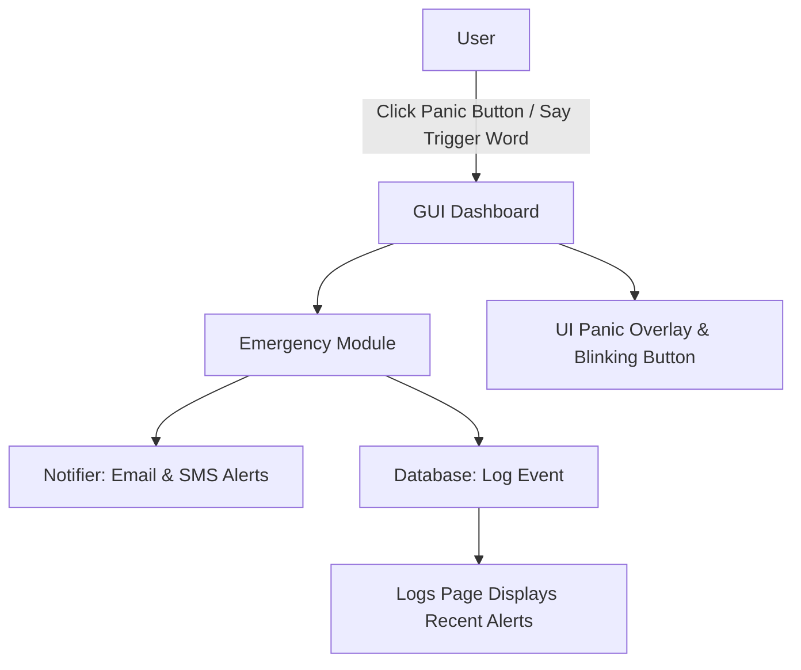

# Women Safety App - Technical Documentation

## 📖 Introduction & Purpose
The **Women Safety App** is a Python-based desktop application designed to provide instant emergency alerts, share live location, and notify pre-configured contacts via **Email** and **SMS** in case of danger.  
It provides a **panic button**, **voice-triggered emergency mode**, and **event logging** for safety tracking.

---

## 🏗 System Architecture


Key points:
- **Frontend**: Tkinter-based dashboard, settings, logs.
- **Backend**: SQLite database for contacts, events, settings.
- **Voice Trigger**: Continuous microphone listening for a keyword.
- **Notifier**: Sends alerts via Brevo SMTP & Fast2SMS API.
- **Location**: Obtains GPS (or IP fallback) location and includes in alerts.

---

## 📸 UI Screenshots

Below are the key screens of the Women Safety App.  

### 🏠 Dashboard


> The dashboard provides a **Panic Button** (with blinking effect when active), **live waveform visualization** for voice trigger monitoring, and a preview of the most recent alerts.

---

### ⚙️ Settings


> The settings page allows users to configure **Email/SMS settings**, **voice trigger word**, and manage emergency contacts.

---

### 📜 Logs


> The logs page displays **all recorded emergency events**, with timestamps, methods used (Email, SMS), location data, and message.  
Users can **export logs to CSV** or **clear all history** from here.

---

## 📂 Folder & Module Structure

```
WomenSafetyApp/
│
├── database/
│   └── db.py              # Database initialization & operations
│
├── modules/
│   ├── emergency.py       # Handles emergency triggers, plays siren, logs events
│   ├── gui_dashboard.py   # Main dashboard UI (panic button, log preview, waveform)
│   ├── gui_logs.py        # Logs UI (history table, CSV export, clear)
│   ├── gui_settings.py    # Settings UI (contacts, SMTP, voice trigger config)
│   ├── gui_theme.py       # Centralized color & style definitions
│   ├── location.py        # GPS/IP location fetcher
│   ├── notifier.py        # Email/SMS sending utilities
│   └── voice_listener.py  # Continuous speech recognition & panic trigger
│
├── main.py                # App entry point, builds header/footer, page routing
├── schema.sql             # SQL schema for contacts, events, settings
├── requirements.txt       # Project dependencies
└── README.md
```

---

## 🗄 Database Schema

**contacts**
| Field | Type | Notes |
|------|------|-------|
| id | INTEGER (PK) | Auto-increment |
| name | TEXT | Contact name |
| phone | TEXT | Phone number |
| email | TEXT | Email address |
| notes | TEXT | Additional notes |

**events**
| Field | Type | Notes |
|------|------|-------|
| id | INTEGER (PK) | Auto-increment |
| timestamp | TEXT | Date/time of alert |
| latitude | TEXT | Latitude of event |
| longitude | TEXT | Longitude of event |
| address | TEXT | Resolved human-readable address |
| message | TEXT | Alert message |
| methods | TEXT | Methods used (Email, SMS, Voice, Manual) |

**settings**
| Field | Type | Notes |
|------|------|-------|
| id | INTEGER (PK) | Auto-increment |
| key | TEXT UNIQUE | Setting key |
| value | TEXT | Setting value |

---

## ⚙ Configuration

### `.env`
Example:
```env
BREVO_API_KEY=your_smtp_api_key
FAST2SMS_API_KEY=your_sms_gateway_key
```

### `config.json`
```json
{
  "trigger_phrase": "help me",
  "auto_stop_duration": 40000
}
```

---

## 🧩 Function-Level Documentation

### **database/db.py**
- `init_db()` – Creates database tables.
- `add_contact(name, phone, email, notes)` – Adds a new emergency contact.
- `get_all_contacts()` – Fetches all contacts.
- `log_event(...)` – Logs an emergency event (with location + message).
- `get_all_events(limit=None)` – Retrieves recent event logs.
- `clear_events()` – Deletes all events.

### **modules/emergency.py**
- `trigger_emergency(alert_type, auto_stop)` – Main panic handler, plays siren, sends alerts, logs event.
- `stop_siren()` – Stops the currently playing siren.

### **modules/voice_listener.py**
- `start()` – Starts continuous listening & waveform visualization.
- `_listen_continuous()` – Captures microphone audio, performs speech recognition.
- `_trigger_panic_mode()` – Activates panic UI + runs `trigger_emergency()` in a background thread.

---

## 🎙 Voice Listener Flow

1. Starts a `sounddevice.InputStream` to capture live audio.
2. Draws real-time waveform on Tkinter canvas.
3. Performs speech recognition every few seconds.
4. If `trigger_phrase` is detected → calls `_trigger_panic_mode()`.
5. Panic button UI updates → blinking starts → alerts sent.

---

## 📢 Notification System

- **Email Alerts**: Uses Brevo SMTP API to send emails to contacts.
- **SMS Alerts**: Uses Fast2SMS API (or configured gateway) to send SMS.
- **Logging**: Each alert is stored in the `events` table for auditing.

---

## 🖼 UI Overview

- **Dashboard:** Panic button, blinking animation, voice waveform, recent logs.
- **Settings:** Configure SMTP keys, voice trigger phrase, add/delete contacts.
- **Logs:** View, refresh, export, and clear history of alerts.

> Screenshots can be added under `docs/screenshots/`.

---

## 🧪 Testing Guide

### Manual Test Checklist:
- ✅ Launch app → Dashboard loads successfully.
- ✅ Click PANIC button → siren plays, button blinks, event logged.
- ✅ Voice trigger word → triggers panic mode automatically.
- ✅ Email + SMS alerts sent to all contacts.
- ✅ Logs page shows new alert entry.
- ✅ Export to CSV works and generates a proper file.
- ✅ Clear logs → removes all logs from UI & database.

### Edge Cases:
- Test with **no internet** → ensure graceful fallback.
- Test with **empty contacts list** → app should warn user.
- Test voice recognition with background noise.

---

## 🛠 Known Issues & Future Improvements

- 🎙 **Voice Trigger Sensitivity:** May misfire in noisy environments → can add a confidence threshold.
- 📡 **GPS Accuracy:** Currently falls back to IP-based location if GPS unavailable.
- 🌐 **Offline Mode:** Could add local siren-only mode when internet unavailable.
- 📱 **Mobile Companion App:** Future enhancement for cross-device alerts.

---

**Maintainer:** Bhavesh Gharat  
**License:** MIT  
**Status:** Stable (UI polish + testing ongoing)